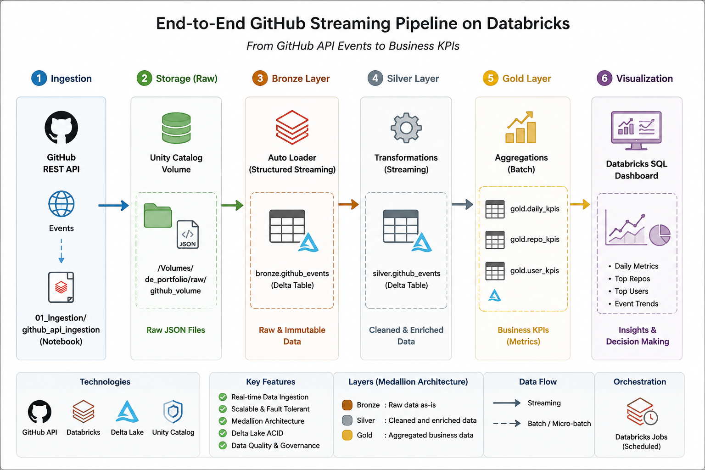
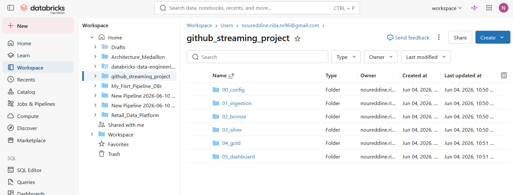
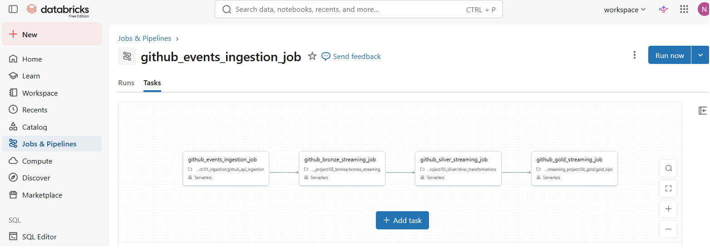
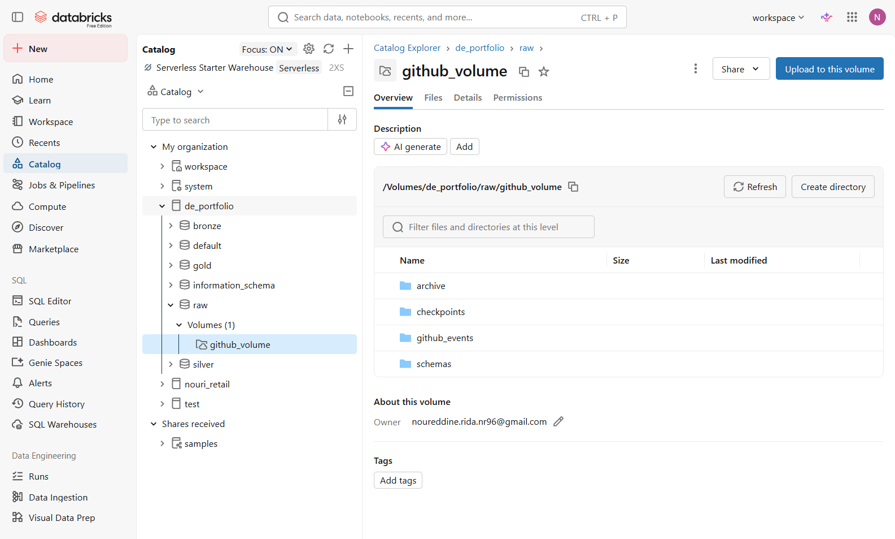
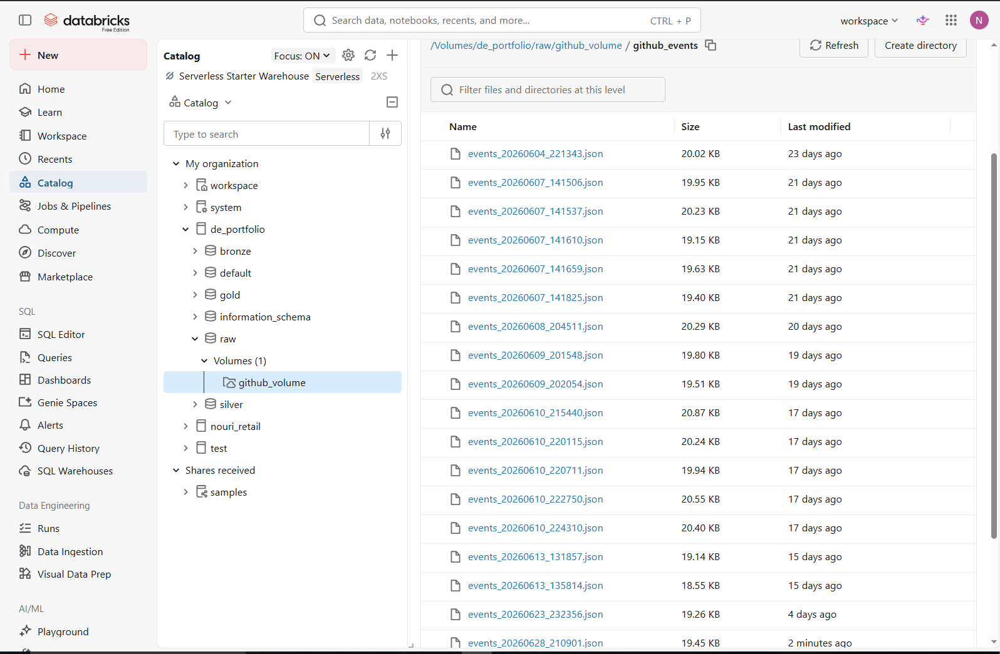
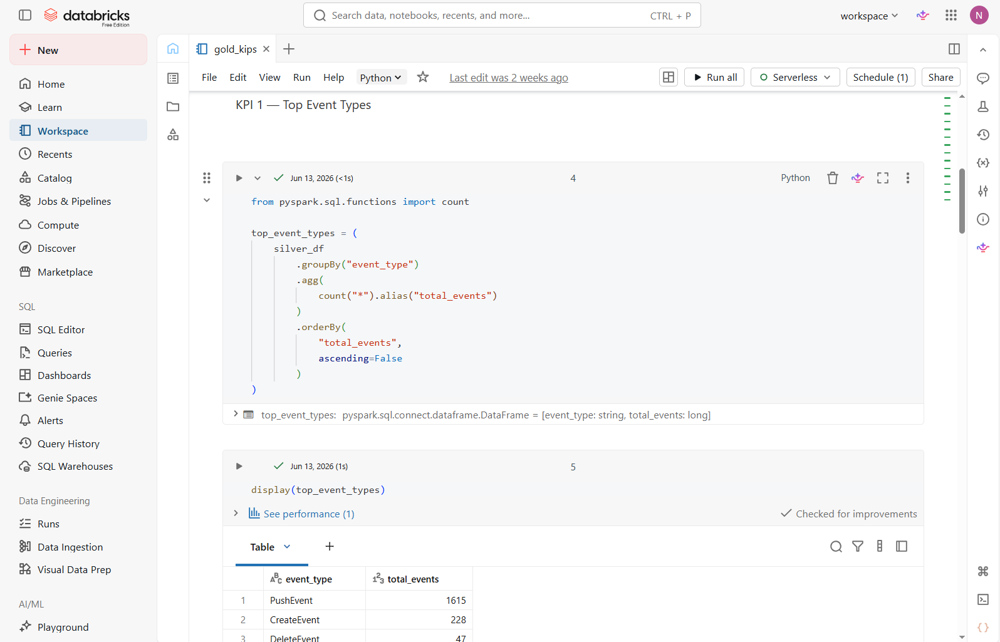
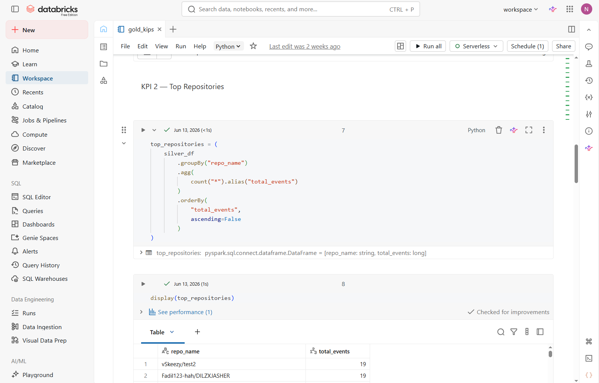
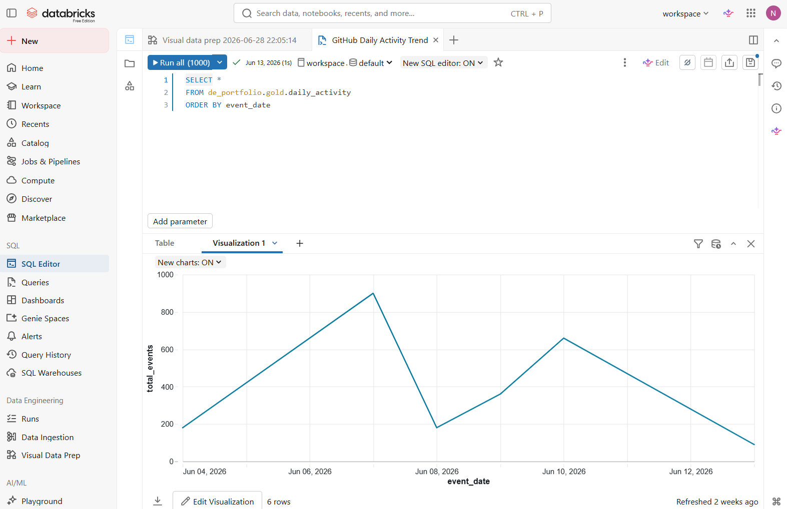
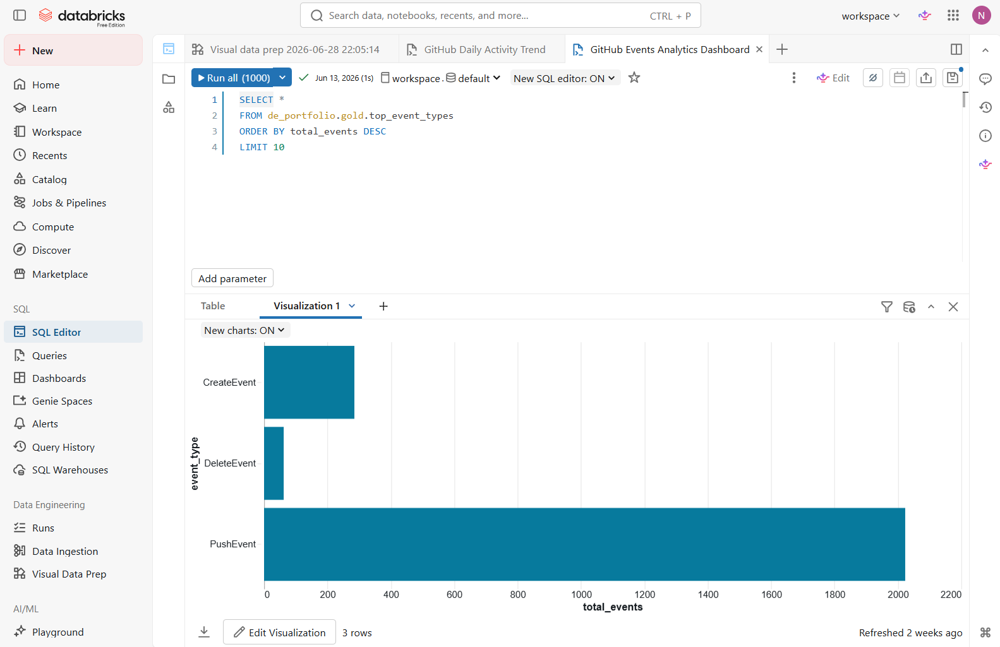
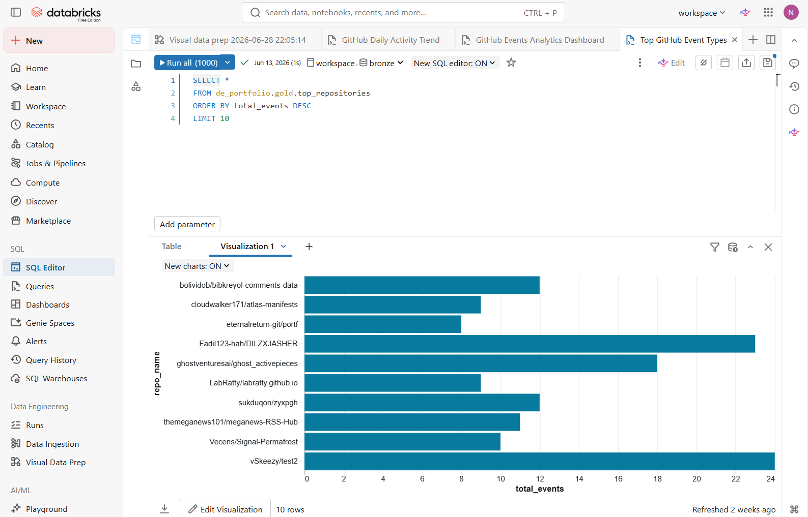

# 🚀 End-to-End GitHub Streaming Data Pipeline on Databricks


---

## 📌 Project Overview

This project demonstrates an end-to-end streaming data pipeline built on **Databricks Free Edition** using the **Medallion Architecture (Bronze → Silver → Gold)**.

GitHub Events are collected through the GitHub REST API, stored as JSON files in Databricks Volumes, automatically ingested with Auto Loader, processed with Structured Streaming and PySpark, transformed into analytical datasets, and finally exposed as business KPIs through Gold tables and dashboards.

The project follows modern Data Engineering best practices including:

- Incremental ingestion
- Delta Lake
- Unity Catalog
- Databricks Workflows
- Structured Streaming
- Auto Loader
- Layered Lakehouse Architecture

---

# 🏗 Architecture
<p align="center">
  
</p>

```
                 GitHub REST API
                        │
                        ▼
              Ingestion Notebook
                        │
                        ▼
          Databricks Volume (Raw JSON)
                        │
                        ▼
                 Auto Loader
                        │
                        ▼
              Bronze Delta Table
                        │
                        ▼
             Silver Delta Table
                        │
                        ▼
              Gold KPI Tables
                        │
                        ▼
          Databricks Dashboard
```


---

# 🏛 Medallion Architecture

## 🥉 Bronze Layer

Raw GitHub Events are ingested from the GitHub REST API.

Responsibilities:

- Raw JSON storage
- Incremental ingestion
- Auto Loader
- Streaming ingestion

---

## 🥈 Silver Layer

Data cleaning and transformation.

Responsibilities:

- Parse nested JSON
- Extract useful fields
- Standardize columns
- Data preparation

---

## 🥇 Gold Layer

Business-ready analytical tables.

KPIs include:

- Top Event Types
- Top GitHub Users
- Top Repositories
- Daily Activity

---

# ⚙ Technologies Used

| Category | Technology |
|------------|---------------------------|
| Platform | Databricks Free Edition |
| Language | Python |
| Processing | PySpark |
| Streaming | Structured Streaming |
| Storage | Delta Lake |
| Ingestion | GitHub REST API |
| Governance | Unity Catalog |
| Storage Layer | Databricks Volumes |
| Workflow | Databricks Jobs |
| Visualization | Databricks Dashboard |
| Version Control | Git & GitHub |

---

# 📂 Repository Structure

```
databricks-streaming-project/

│
├── notebooks/
│   ├── 00_config
│   ├── 01_ingestion
│   ├── 02_bronze
│   ├── 03_silver
│   ├── 04_gold
│   └── 05_dashboard
│
├── architecture/
│
├── screenshots/
│
├── docs/
│
└── README.md
```

---

# 🔄 Data Pipeline Flow

```
GitHub API

      │

      ▼

JSON Files

      │

      ▼

Databricks Volume

      │

      ▼

Auto Loader

      │

      ▼

Bronze

      │

      ▼

Silver

      │

      ▼

Gold

      │

      ▼

Dashboard
```

---

# 🚀 Pipeline Workflow

The pipeline is orchestrated using **Databricks Workflows**.

Execution Order:

1. GitHub API Ingestion
2. Bronze Streaming
3. Silver Transformation
4. Gold KPI Generation

The workflow automatically executes tasks according to their dependencies.

---

# 📊 Gold KPIs

The project generates business-ready analytical tables:

- Top Event Types
- Top GitHub Users
- Top Repositories
- Daily Activity

These tables can be directly consumed by dashboards or BI tools.

---

# 📈 Dashboard

The dashboard displays:

- GitHub Event Distribution
- Most Active Users
- Most Active Repositories
- Daily GitHub Activity

*(Dashboard screenshots will be added in the `screenshots` folder.)*

---

# 📦 Databricks Components Used

- Unity Catalog
- Catalogs
- Schemas
- Volumes
- Auto Loader
- Structured Streaming
- Delta Tables
- Databricks Jobs
- Workflows
- Dashboards

---

# ✨ Project Features

✔ GitHub REST API Integration

✔ Incremental Data Ingestion

✔ Databricks Auto Loader

✔ Structured Streaming

✔ Delta Lake

✔ Unity Catalog

✔ Bronze / Silver / Gold Architecture

✔ Workflow Orchestration

✔ Dashboard Reporting

✔ End-to-End Data Pipeline

---

## 📸 Project Screenshots

### Architecture



### Databricks Workspace



### Job Workflow



### Unity Catalog



### Volume



### Gold Table





### Dashboard







---

# 🔮 Future Improvements

- Delta Live Tables (DLT)
- MERGE INTO Incremental Processing
- Data Quality Expectations
- CI/CD Deployment
- Terraform Infrastructure
- Azure DevOps / GitHub Actions
- Monitoring & Alerts

---

# 👨‍💻 Author

**Noureddine RIDA**

Data Engineer | Python | PySpark | Databricks | SQL

GitHub:
https://github.com/NouriRD

LinkedIn:
*(Add your LinkedIn profile here)*

---

# ⭐ If you found this project useful

Please consider giving it a ⭐ on GitHub.
